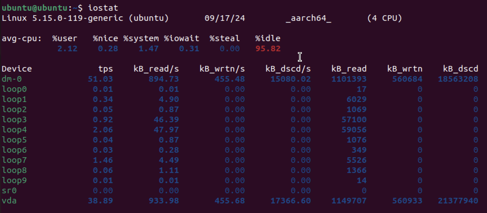
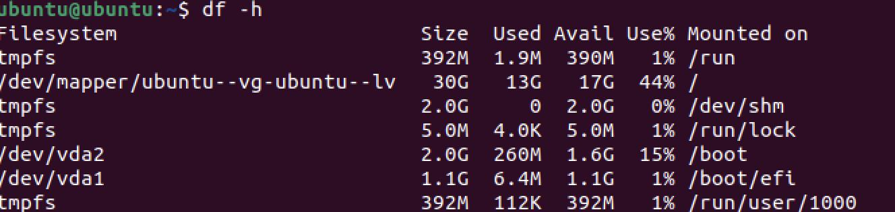

# Task 1: Key Metrics for SRE and SLAs

## 1. Monitor System Resources 

### CPU Usage (command: `htop`)
3 most consuming applications for CPU:
1. `/usr/bin/gnome-shell`
2. `/usr/libexec/gnome-terminal-server`
3. `/usr/sbin/spice-vdagent`

### Memory Usage (command: `htop`)
3 most consuming applications for memory:
1. `/usr/bin/gnome-shell`
2. `/usr/lib/libreoffice/program/soffice.bin --calc`
3. `/usr/bin/gnome-calendar --gapplication-service`

### I/O Usage  (command: `iostat`)
We observe that the system is mostly idle (95.82%) and has low I/O wait (0.31%). The dm-0 device handles most of the I/O activity, showing 894.73 KB/s for reading and 455.48 KB/s for writing.

## 2. Disk Space Management (command: `sudo du -h /var | sort -rh I head -n`)

### Top 3 Largest Files in `/var`
1. **/var** - 2.1G
2. **/var/lib** - 1.8G
3. **/var/lib/snapd** - 1.5G

### Disk space usage (command: `df -h`)

