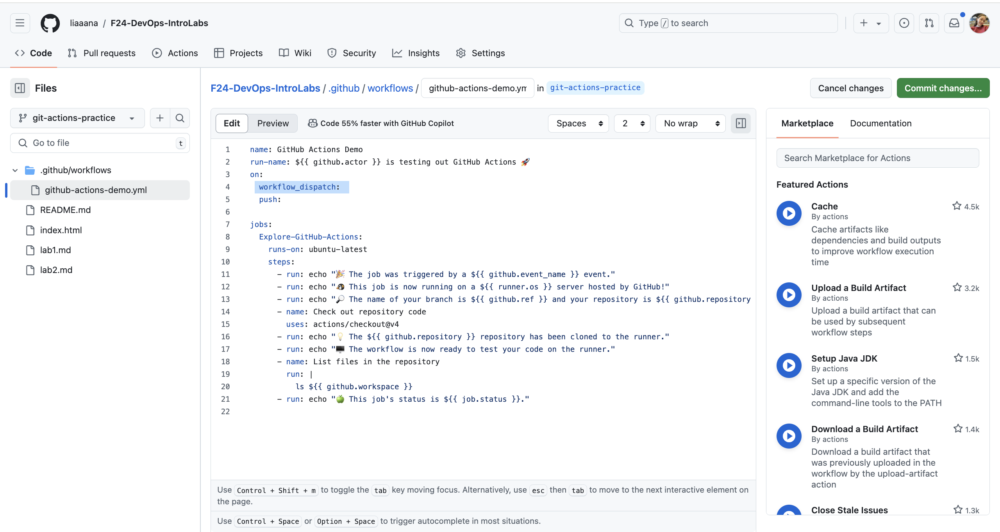
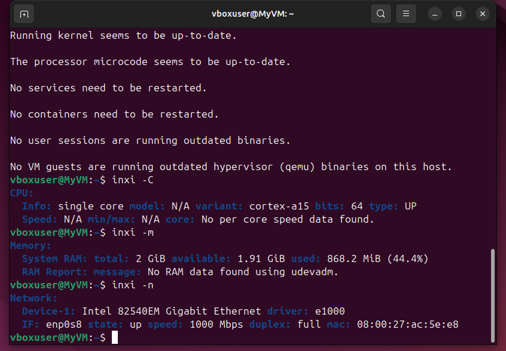
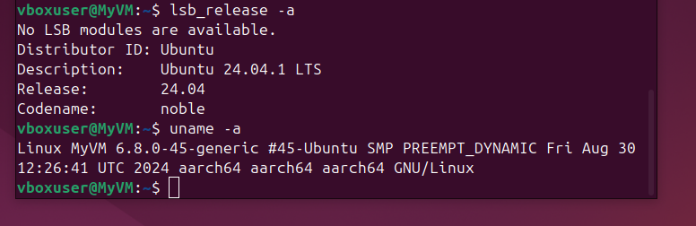
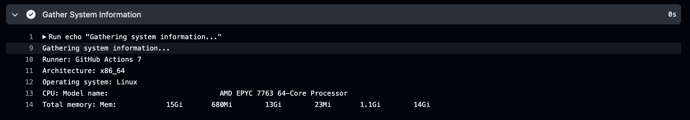

# CI/CD Lab - GitHub Actions
Explored continuous integration and continuous deployment (CI/CD) practices using GitHub Actions.

## Task 1: Create Your First GitHub Actions Pipeline

Set up a basic GitHub Actions workflow and observed its execution by [tutorial](https://docs.github.com/en/actions/quickstart)

1. **Read the Official Guide**:

Followed the official GitHub Actions [quickstart guide](https://docs.github.com/en/actions/quickstart).

**Key concepts:**
GitHub Actions is powerful tool that has many advantages:
- **Workflow Automation**: GitHub Actions enables setting up workflows triggered by events such as pull requests or code pushes, automating build, test, and deployment processes.
- **Preset Templates**: To facilitate quick setup and customization, GitHub offers a variety of preset workflow templates.
- **Integration into GitHub repositories**: Workflows can be executed within projects, and logs and results can be monitored through the Actions tab on the repository interface, thanks to seamless integration with GitHub repositories.

**Steps and observations:**
1) Created new branch `git-actions-practice`
2) Creates a workflow file called `github-actions-demo.yml` in the `.github/workflows directory`
3) Copied the following YAML contents into the `github-actions-demo.yml` file:
```
name: GitHub Actions Demo
run-name: ${{ github.actor }} is testing out GitHub Actions 🚀
on: [push]
jobs:
  Explore-GitHub-Actions:
    runs-on: ubuntu-latest
    steps:
      - run: echo "🎉 The job was automatically triggered by a ${{ github.event_name }} event."
      - run: echo "🐧 This job is now running on a ${{ runner.os }} server hosted by GitHub!"
      - run: echo "🔎 The name of your branch is ${{ github.ref }} and your repository is ${{ github.repository }}."
      - name: Check out repository code
        uses: actions/checkout@v4
      - run: echo "💡 The ${{ github.repository }} repository has been cloned to the runner."
      - run: echo "🖥️ The workflow is now ready to test your code on the runner."
      - name: List files in the repository
        run: |
          ls ${{ github.workspace }}
      - run: echo "🍏 This job's status is ${{ job.status }}."
```
4) Committed changes 

5) Committing the workflow file to a branch in the repository triggered the push event and ran the workflow.
6) Navigated to the main page of the repository, then to the `Actions` page, and selected the workflow I wanted to display ("GitHub Actions Demo"). Clicked on the `Explore-GitHub-Actions`, which showed how each step was processed. Expanding any of the steps revealed detailed logs for that step.


2. **Observe the Workflow Execution**:

Pushed some changes to repository and observed the GitHub Actions workflow execution.


Output and observations:
- Every step in the workflow completed successfully without any errors. The output logs showed the expected behavior.
- The deployment time has improved from 19 seconds to 17 seconds.


## Task 2: Gathering System Information and Manual Triggering

Extended workflow to include manual triggering and system information gathering.

1. **Configured a Manual Trigger**:
Extended existing GitHub Actions workflow to include a [manual trigger](https://docs.github.com/en/actions/using-workflows/triggering-a-workflow#defining-inputs-for-manually-triggered-workflows)

Steps and changes:
1) Added this line:

2) Faced probblems with finding button `run workflow`. Resolved issue by merging the `git-actions-practice` to the `master` branch



2. **Gather System Information**:
1) Modified the workflow to include an additional step for gathering system information. Used the appropriate actions and steps to collect information about the runner, hardware specifications, and operating system details.

Changes and gathered system information:
1) Added part into `github-actions-demo2.yml`:
```
- name: Gather System Information
   run: |
      echo "Gathering system information..."
      echo "Runner: ${{ runner.name }}"
      echo "Architecture: $(uname -m)"
      echo "Operating system: ${{ runner.os }}"
      echo "CPU: $(lscpu | grep 'Model name')"
      echo "Total memory: $(free -h | grep 'Mem:')"
```


2) Gathered system information:


Last line details:
- Total Memory: 15 GiB
- Used Memory: 680 MiB
- Free Memory: 13 GiB
- Buffers/Cache Memory: 23 MiB
- Kernel Memory:** 1.1 GiB
- Available Memory for Applications: 14 GiB